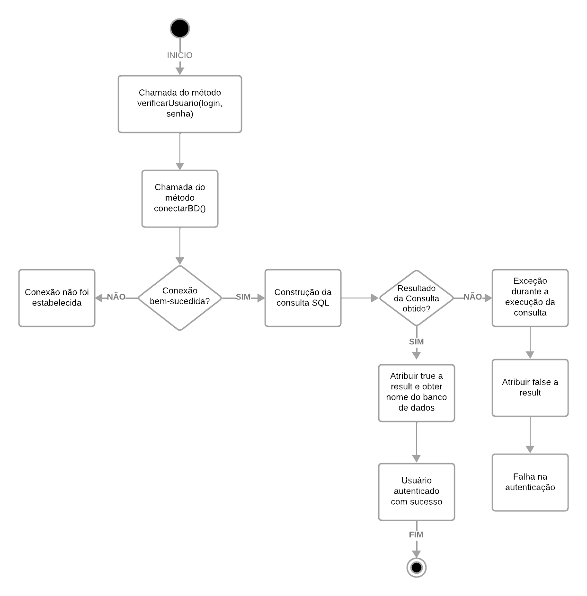

## Grafo de Fluxo
 

## Cálculo da complexidade ciclomática
M = E − N + 2P
- E = 13 (número de arestas)
- N = 13 (número de nós)
- P = 1 (há apenas um componente conectado).

Substituindo esses valores na fórmula, obtemos:

M = 13 − 13 + 2×1 = 2

## Caminhos possível no código

1. Caminho Principal (Usuário Autenticado):
    - Ponto 1 -> Ponto 2 -> Ponto 3 -> Ponto 5 -> Ponto 6 -> Ponto 7 -> Ponto 8 -> Ponto 9 -> Ponto 10 -> Ponto 11 -> Ponto 13

2. Caminho de Falha na Conexão ao Banco de Dados:
    - Ponto 1 -> Ponto 2 -> Ponto 4 -> Ponto 5

3. Caminho de Falha na Consulta SQL:
    - Ponto 1 -> Ponto 2 -> Ponto 3 -> Ponto 5 -> Ponto 6 -> Ponto 7 -> Ponto 8 -> Ponto 9 -> Ponto 10 -> Ponto 12
